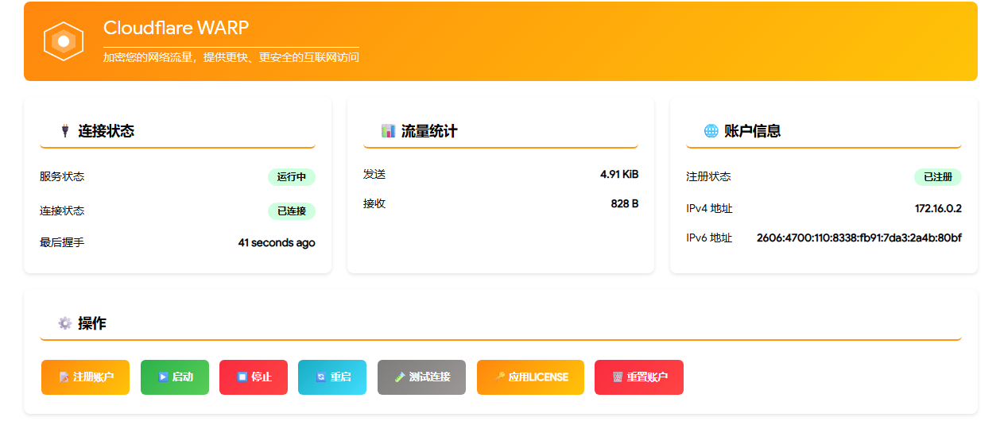

# luci-app-warp

[](LICENSE)
[](https://openwrt.org/)

OpenWrt 平台的 Cloudflare WARP LuCI 管理界面，使用 `usque` 的 MASQUE 模式接入 Cloudflare WARP，支持全局流量接管。



## ✨ 功能特性

- 🚀 **一键安装** - 自动安装所有依赖并配置
- 🔐 **自动注册** - 无需手动获取配置文件，自动注册WARP账户
- 🌍 **全局代理** - 支持全局流量接管模式
- 🇨🇳 **绕过中国IP** - 可选择性绕过中国大陆IP，优化国内访问
- 📊 **状态监控** - 实时显示连接状态、流量统计
- 🔑 **WARP+升级** - 支持应用License Key升级到WARP+
- 🎨 **现代UI** - 美观的LuCI管理界面

## 📦 依赖

- OpenWrt 21.02 或更高版本
- `usque` (Cloudflare MASQUE 客户端，OpenWrt 官方源通常不提供)
- `jsonfilter`
- `ca-bundle`
- `kmod-tun` 或固件内置的 `/dev/net/tun`
- 可选：`curl`（WARP+ License 和连接测试命令需要）、`microsocks`（SOCKS5 代理需要）

## 🚀 快速安装

### 方法一：一键安装脚本（推荐）

```bash
wget -O- https://raw.githubusercontent.com/hxzlplp7/luci-app-warp/main/install.sh | sh
```

或者：

```bash
curl -fsSL https://raw.githubusercontent.com/hxzlplp7/luci-app-warp/main/install.sh | sh
```

### 方法二：手动安装

1. **安装依赖**

```bash
opkg update
opkg install luci-base jsonfilter ca-bundle
opkg install curl microsocks || true
```

`curl` 和 `microsocks` 是运行时可选组件；安装失败不会阻止 LuCI 应用安装，但对应功能不可用。如果 `ls -l /dev/net/tun` 不存在，再安装与当前固件内核完全匹配的 `kmod-tun`。很多定制固件已经内置 TUN，此时不需要额外安装 `kmod-tun`。

`usque` 不在 OpenWrt 官方 feed 中。可先运行本项目的一键安装脚本让它自动下载上游预编译文件，或从 [Diniboy1123/usque releases](https://github.com/Diniboy1123/usque/releases) 下载匹配架构的 Linux zip，把其中的 `usque` 放到 `/usr/bin/usque` 并赋予执行权限。

2. **下载并安装 LuCI 应用**

```bash
# 克隆仓库
git clone https://github.com/hxzlplp7/luci-app-warp.git /tmp/luci-app-warp

# 复制文件
cp -r /tmp/luci-app-warp/root/* /
cp -r /tmp/luci-app-warp/htdocs/* /www/

# 设置权限
chmod +x /usr/bin/warp-manager
chmod +x /usr/bin/warp-update-china
chmod +x /usr/bin/warp-log
chmod +x /etc/init.d/warp
chmod +x /etc/init.d/warp-cron

# 启用服务
/etc/init.d/warp enable
/etc/init.d/rpcd restart
rm -rf /tmp/luci-indexcache /tmp/luci-modulecache
```

### 方法三：从源码编译

```bash
# 进入OpenWrt源码目录
cd openwrt

# 克隆到 package 目录
git clone https://github.com/hxzlplp7/luci-app-warp.git package/luci-app-warp

# 编译
make package/luci-app-warp/compile V=s
```

不要把这个仓库直接作为 `src-git` feed 添加；该仓库当前是单包目录布局，直接放入 OpenWrt 的 `package/luci-app-warp` 目录编译即可。官方 OpenWrt feeds 也没有 `usque` 包，IPK 安装前仍需单独准备 `/usr/bin/usque`。

## 📖 使用说明

### Web界面（LuCI）

1. 打开路由器管理界面
2. 导航到 **服务 → Cloudflare WARP**
3. 在 **状态** 页面点击 **注册账户**
4. 注册成功后点击 **启动** 开始使用

### 命令行

```bash
# 注册账户
warp-manager register

# 启用并启动服务
warp-manager start

# 停止服务并取消启用
warp-manager stop

# 启用并重启服务
warp-manager restart

# 查看状态
warp-manager status

# 测试连接
warp-manager test

# 应用License Key升级到WARP+
warp-manager license aBcD1234-eFgH5678-iJkL9012

# 导出生成的原始 usque 配置
warp-manager export

# 重置账户
warp-manager reset
```

如果日志里反复出现 `Failed to connect tunnel: timeout: no recent network activity`，通常是 UDP/QUIC 443 被阻断。可在 LuCI 设置页启用 **使用 HTTP/2**，或命令行执行：

```bash
uci set warp.config.http2='1'
uci commit warp
warp-manager restart
```

### 服务管理

```bash
# 启动服务（不会自动修改 /etc/config/warp 里的 enabled）
/etc/init.d/warp start

# 停止服务（不会自动取消 enabled 勾选）
/etc/init.d/warp stop

# 重启服务（不会自动修改 enabled）
/etc/init.d/warp restart

# 查看服务状态
/etc/init.d/warp status
```

## ⚙️ 配置选项

| 选项 | 说明 | 默认值 |
|------|------|--------|
| `enabled` | 启用WARP | `0` |
| `endpoint` | WARP服务器地址 | `engage.cloudflareclient.com:2408` |
| `mtu` | MTU值 | `1280` |
| `dns` | DNS服务器 | `1.1.1.1` |
| `ipv6` | 启用IPv6 | `1` |
| `global_proxy` | 全局代理模式 | `0` |
| `bypass_china` | 绕过中国大陆IP | `0` |

### 配置文件

配置文件位于 `/etc/config/warp`：

```
config warp 'config'
    option enabled '1'
    option endpoint 'engage.cloudflareclient.com:2408'
    option dns '1.1.1.1'
    option ipv6 '1'
    option global_proxy '0'
    option bypass_china '0'
    option address_v4 '172.16.0.x'
    option address_v6 '2606:4700:xxx'
```

## 🌐 全局流量接管

启用全局代理后，所有来自LAN的流量都将通过WARP隧道：

1. 在设置中开启 **全局代理**
2. 防火墙会自动配置 LAN → WARP 的转发规则
3. 所有设备无需额外配置即可使用

### 绕过中国大陆IP

如果需要国内网站直连：

1. 在设置中开启 **绕过中国大陆IP**
2. 系统会自动下载并应用中国IP列表
3. 访问国内网站时走直连，国外网站走WARP

## 🔧 Endpoint 优选

如果连接不稳定，可以尝试更换Endpoint：

```bash
# 常用Endpoint
engage.cloudflareclient.com:2408
engage.cloudflareclient.com:500
engage.cloudflareclient.com:854
engage.cloudflareclient.com:4500

# 或使用优选IP
162.159.192.1:2408
162.159.193.1:2408
162.159.195.1:2408
```

## ❓ 常见问题

### Q: 注册失败怎么办？

A: 确保路由器能正常访问外网，检查DNS设置。如果仍然失败，可能是Cloudflare API暂时不可用，稍后再试。

### Q: 为什么 `opkg install usque` 找不到软件包？

A: OpenWrt 官方软件源通常没有 `usque`。本项目的一键安装脚本会先尝试 `opkg install usque`，失败后再从上游 release 下载预编译 Linux 二进制。x86_64、arm64、armv5/6/7 以及上游提供的 big-endian mips 可以自动安装；常见 MT7621 这类 mipsel 设备需要自行交叉编译 `usque` 并放到 `/usr/bin/usque`。

### Q: 连接后无法上网？

A: 检查以下几点：

1. `usque` 进程是否正在运行：`pgrep -f usque`
2. 虚拟网络接口 (tun) 是否正确创建：`ip link show | grep tun`
3. 防火墙规则是否正确下发到了 tun 接口上：firewall4/nftables 用 `nft list table inet luci_warp`，旧 firewall3/iptables 用 `iptables -t nat -S | grep tun`

### Q: `opkg install /tmp/upload.ipk` 报 `cannot find dependency curl/kmod-tun` 或 `incompatible with the architectures configured`？

A: 先确认设备 feeds 可用、包架构匹配，再安装：

```bash
opkg update
opkg print-architecture
opkg install luci-base jsonfilter ca-bundle
opkg install curl microsocks || true
ls -l /dev/net/tun || opkg install kmod-tun
opkg install /tmp/upload.ipk
```

如果 `curl` 或 `microsocks` 找不到，可先忽略；v1.3.7 或更新版本不会因为这两个可选组件缺失而拒绝安装。如果 `kmod-tun` 找不到，但 `/dev/net/tun` 已存在，说明固件已经内置 TUN；旧版 IPK 会因为硬依赖 `kmod-tun` 被 opkg 拒绝安装。`Architecture: all` 应该能被标准 OpenWrt 接受，如果 `opkg print-architecture` 没有 `arch all 1`，需要先修复固件的 opkg 架构配置。

### Q: 安装/启动后 OpenClash 失效怎么办？

A: WARP 的全局接管会向主路由表写入 `0.0.0.0/1` 和 `128.0.0.0/1`，会和 OpenClash 抢流量。先恢复路由和防火墙：

```bash
/etc/init.d/warp stop 2>/dev/null
/etc/init.d/warp disable 2>/dev/null
uci set warp.config.enabled='0'
uci set warp.config.global_proxy='0'
uci commit warp
killall usque 2>/dev/null
killall microsocks 2>/dev/null
ip route del 0.0.0.0/1 2>/dev/null
ip route del 128.0.0.0/1 2>/dev/null
nft delete table inet luci_warp 2>/dev/null
/etc/init.d/firewall restart
/etc/init.d/openclash restart
```

如果需要和 OpenClash 共存，不要同时开启 WARP 的“全局流量接管”和 OpenClash 的透明代理。可以二选一，或在确认 WARP SOCKS5 出口实测可用后，再把它作为 OpenClash 的上游代理。

### Q: 如何升级到WARP+？

A: 在LuCI界面点击"应用License"，输入从WARP+订阅获取的License Key。

### Q: 如何获取License Key？

A:

- 购买WARP+订阅
- 通过WARP推荐计划获取免费流量
- 使用第三方生成器（不保证可用性）

## 📝 更新日志

### v1.3.7

- 将 IPK 架构声明改为标准全局 `PKGARCH:=all`，避免纯 LuCI 包被错误构建成目标架构包
- 移除 IPK 对 `curl`、`kmod-tun`、`microsocks` 的硬依赖，改为运行时按功能检查，兼容 feeds 不完整或已内置 TUN 的定制固件
- 默认关闭全局流量接管，降低与 OpenClash 等透明代理共存时的路由冲突风险

### v1.3.6

- 修复 HTTP/2 模式下只保护 `endpoint_v4` 路由，未保护 `endpoint_h2_v4` 可能导致 endpoint 直连路由不完整的问题

### v1.3.5

- 修复 IPK `postinst` 同步重启 `rpcd` 时可能导致 `opkg install` 卡在 `Configuring luci-app-warp` 的问题

### v1.3.4

- 修复 `usque` 连接超时循环中停止/重启可能卡住的问题，停止时会在短超时后清理残留进程

### v1.3.3

- 新增 HTTP/2 fallback 和自定义 SNI 设置，用于默认 HTTP/3/QUIC MASQUE 超时的网络

### v1.3.2

- 修复 LuCI 日志页在部分 OpenWrt 上读不到 `logread` 的问题，新增 `/usr/bin/warp-log` 作为日志入口
- 修复 MASQUE 模式下状态页依赖 RX 流量判断连接，导致空闲时一直显示“连接中”的问题
- 修复状态页启动/停止/重启按钮不同步 `enabled` 配置，导致按钮看起来没反应的问题

### v1.3.1

- 修复一键安装脚本未安装 LuCI JS 视图、菜单、ACL、辅助脚本的问题
- 修复手动安装文档仍引用不存在的 `luasrc` 目录
- 修复 `warp-manager` shell 语法错误和 WireGuard 残留说明
- NAT 规则改为优先使用 firewall4/nftables，旧系统才回退到 iptables
- 明确 `usque` 不属于 OpenWrt 官方源，需要通过脚本或上游 release 单独安装

### v1.3.0

- 🚀 将核心连接逻辑由 WireGuard 迁移至 MASQUE 协议 (使用 `usque`)
- ✨ 更新守护进程使用 OpenWrt 官方 `procd` 进行管理
- ✨ 移除废弃的 WireGuard UI 设置选项
- 🐛 提升在中国大陆等复杂网络环境下的握手及代理稳定性

### v1.0.0 (2024-12-20)

- 🎉 首次发布
- ✨ 支持自动注册WARP账户
- ✨ 支持全局流量接管
- ✨ 支持绕过中国大陆IP
- ✨ 支持WARP+ License升级
- ✨ LuCI管理界面

## 🙏 致谢

- [Cloudflare WARP](https://1.1.1.1/) - 免费的VPN服务
- [usque](https://github.com/Diniboy1123/usque) - Cloudflare MASQUE 客户端
- [OpenWrt](https://openwrt.org/) - 开源路由器操作系统

## 📄 许可证

本项目采用 [GPL-3.0](LICENSE) 许可证。

---

如有问题或建议，欢迎提交 [Issue](https://github.com/hxzlplp7/luci-app-warp/issues)！
